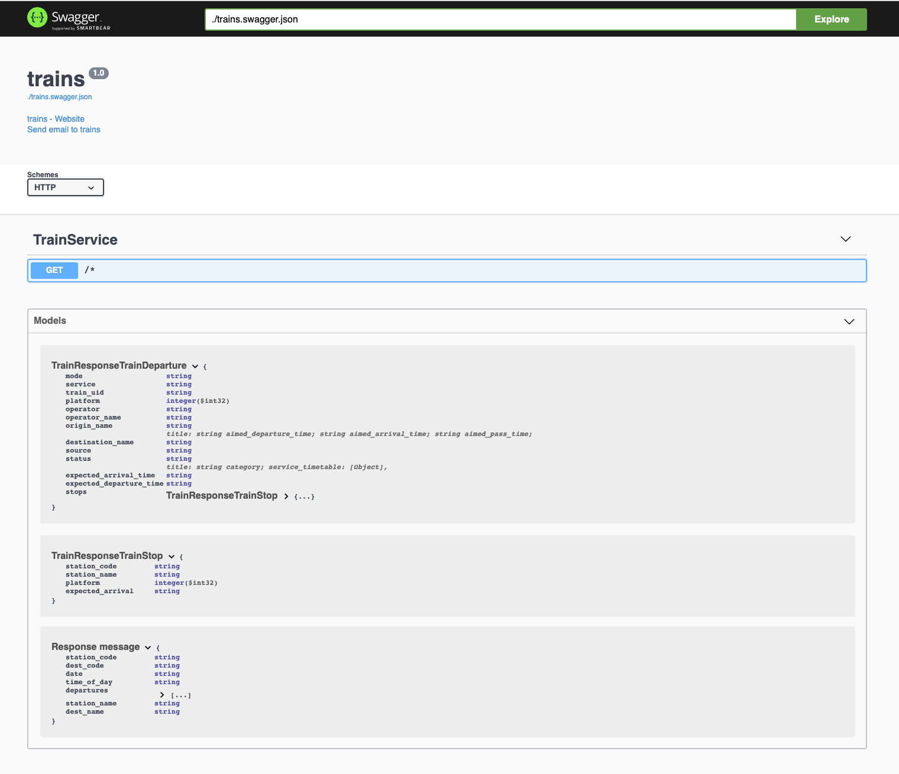

# trains - server side tools
Walk through each of the server side utilities that encapsulate an [transportapi.com](transportapi.com) endpoint and allow you to access it through a web API.

## [expressTrainsServer.js](javascript/expressTrainsServer.js)
`express.js` version which creates a web server listening on localhost port 8001 for input with the following query parameter format in a browser where `from` and `to` are specified as three letter codes:
```
http://localhost:8001/?from=PAD&to=TWY
```
Alternatively can be `curled` as follows:
```
$ curl "http://localhost:8001/?from=PAD&to=TWY"
```
The server is instantiated as follows:
```
$ node expressTrainsServer.js 
Example app listening on port 8001
```
This results in the same simple text-based output being displayed as the command line cases whether the endpoint is invoked using a `curl` command or whether it is rendered in the browser window.

## [grpcTrainsServer.js](javascript/grpcTrainsServer.js)
`protobuf.js` based version which creates a [`node` gRPC server](https://grpc.io/docs/quickstart/node/) listening on localhost port 8001 for input conforming to the definition laid out in the [`trains.proto`](trains.proto) file.  With this approach `node` dynamically generates service descriptors and client stub definitions from the [`trains.proto`](trains.proto) file at runtime. A corresponding client needs to process the response according to the same definitiion.  An example client implementation, [grpcTrainsClient.js](javascript/grpcTrainsClient.js) is provided which leverages the same dynamic support to invoke the API.  You invoke the `protobuf.js` gRPC server as follows:
```
$ node grpcTrainsServer.js
grpcTrains.js version 0.1 listening on port 8001
```
And the client thus:
```
$ node grpcTrainsClient.js PAD OXF
```
Following the recipe outlined [here](https://blog.csnet.me/blog/building-a-go-api-grpc-rest-and-openapi-swagger.1/) we can create [OpenAPI](https://swagger.io/specification/) documentation for the gRPC API using Go support as follows assuming you have Go set up on your host:
```
$ export GOPATH = transport/go                                                # point GOPATH to local transport/go subdir
$ go get google.golang.org/grpc                                               # install grpc
$ go get -u github.com/grpc-ecosystem/grpc-gateway/protoc-gen-grpc-gateway    # install grpc-gateway
$ go get -u github.com/grpc-ecosystem/grpc-gateway/protoc-gen-swagger         # install swagger support
$ go get -u github.com/golang/protobuf/protoc-gen-go                          # install go proto plugin
$ export PATH=$PATH:$GOPATH/bin                                               # ensure proto-gen-swagger CLI is accessible
$ protoc 
-I. 
-I$GOPATH/src 
-I$GOPATH/src/github.com/grpc-ecosystem/grpc-gateway 
-I$GOPATH/src/github.com/grpc-ecosystem/grpc-gateway/third_party/googleapis 
--plugin=protoc-gen-grpc-gateway=$GOPATH/bin/protoc-gen-grpc-gateway 
--swagger_out=logtostderr=true:. 
trains.proto                                                                  # generate trains.swagger.json output
```
This will generate the [`trains.swagger.json`](trains.swagger.json) file.  You can now view that using `swagger-ui` by using a pre-built `swagger-ui` docker container per the recipe [here](https://github.com/swagger-api/swagger-ui/blob/master/docs/usage/installation.md) as follows:
```
$ docker run -p 80:8080 -e SWAGGER_JSON=/trains/trains.swagger.json -v $PWD:/trains swaggerapi/swagger-ui
```
You should see this output in the browser on navigating to localhost:


## [grpcTrains/server/main.go](go/grpcTrains/server/main.go)
TBD

## Implementation notes
The [expressTrainsServer.js](javascript/expressTrainsServer.js) script creates a server on localhost:8001 using `express.js`.  The [grpcTrainsServer.js](javascript/grpcTrainsServer.js) script provides a gRPC implementation of the service built on the [trains.proto](trains.proto) file which instantiates a [protocol buffer](https://developers.google.com/protocol-buffers/docs/proto) based definition of the interface between client and server. Both implementations are suitable for Dockerisation though [the example provided](javascript/Dockerfile) in this repository is for [expressTrainsServer.js](javascript/expressTrainsServer.js).

Under the hood both scripts leverage [trainsAsyncAwaitClient.js](javascript/trainsAsyncAwaitClient.js) functionality to encapsulate access to the underlying [transportapi.com](transportapi.com) API.
